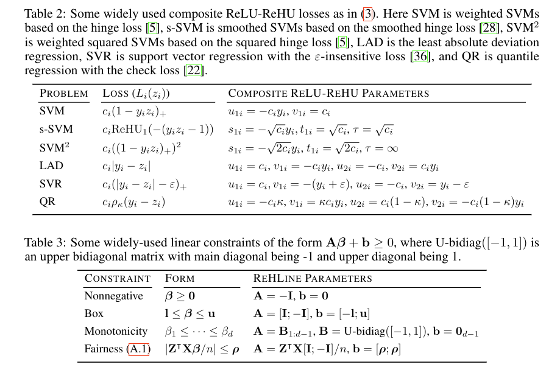
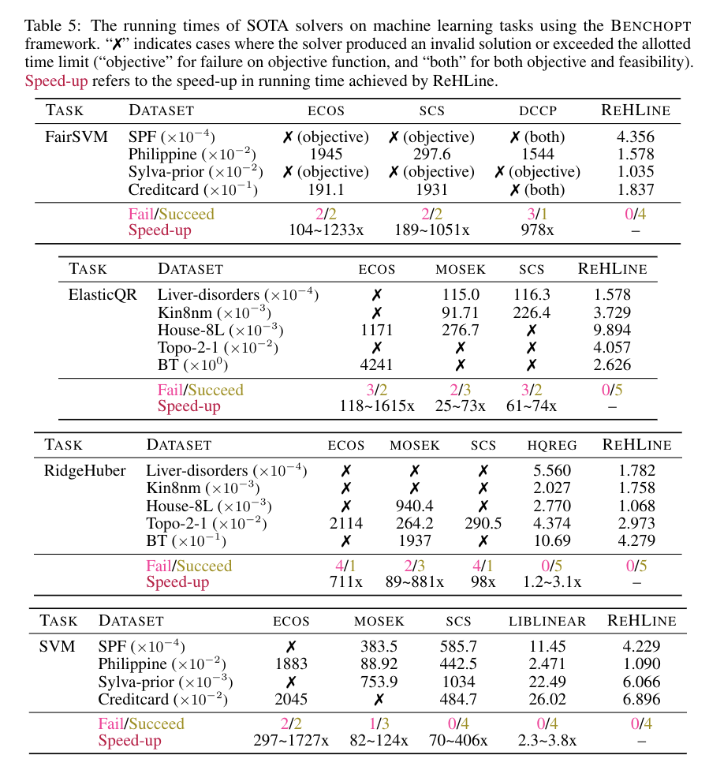

# **ReHLine**

`ReHLine` is designed to be a computationally efficient and practically useful software package for large-scale ERMs.

The proposed **ReHLine** solver has four appealing
``linear properties'':

- It applies to any convex piecewise linear-quadratic loss function, including the hinge loss, the check loss, the Huber loss, etc.
- In addition, it supports linear equality and inequality constraints on the parameter vector.
- The optimization algorithm has a provable linear convergence rate.
- The per-iteration computational complexity is linear in the sample size.

## **Formulation**
`ReHLine` is designed to address the empirical
regularized ReLU-ReHU minimization problem, named
\emph{ReHLine optimization}, of the following form:
of the following form:
$$
\begin{align}
  \min_{\mathbf{\beta} \in \mathbb{R}^d} \ & \sum_{i=1}^n \sum_{l=1}^L \text{ReLU}( u_{li} \mathbf{x}_i^\intercal \mathbf{\beta} + v_{li}) + \sum_{i=1}^n \sum_{h=1}^H {\text{ReHU}}_{\tau_{hi}}( s_{hi} \mathbf{x}_i^\intercal \mathbf{\beta} + t_{hi}) + \frac{1}{2} \| \mathbf{\beta} \|_2^2, \qquad \text{ s.t. } & \mathbf{A} \mathbf{\beta} + \mathbf{b} \geq \mathbf{0},
\end{align}
$$
where $\mathbf{U} = (u_{li}),\mathbf{V} = (v_{li}) \in \mathbb{R}^{L \times n}$ and $\mathbf{S} = (s_{hi}),\mathbf{T} = (t_{hi}),\mathbf{\Tau} = (\tau_{hi}) \in \mathbb{R}^{H \times n}$ are the ReLU-ReHU loss parameters, and $(\mathbf{A},\mathbf{b})$ are the constraint parameters. This formulation has a wide range of applications spanning various fields, including statistics, machine learning, computational biology, and social studies. Some popular examples include SVMs with fairness constraints (FairSVM), elastic net regularized quantile regression (ElasticQR), and ridge regularized Huber minimization (RidgeHuber).

## 📚 **Benchmark (powered by benchopt)**
Some existing problems of recent interest in statistics and machine learning can be solved by `ReHLine`. 
| Problem   |      Results      |
|---------- |:-----------------:|
|[FairSVM](./python/benchmark/benchmark_FairSVM/README.md) | [Result](./python/benchmark/benchmark_FairSVM/outputs/benchmark_FairSVM.html)|
|[ElasticQR](./python/benchmark/benchmark_QR/README.md) | [Result](./python/benchmark/benchmark_QR/outputs/benchmark_QR.html)|
|[RidgeHuber](./python/benchmark/benchmark_Huber/README.md) | [Result](./python/benchmark/benchmark_Huber/outputs/benchmark_Huber.html)|
|[FairSVM](./python/benchmark/benchmark_SVM/README.md) | [Result](./python/benchmark/benchmark_SVM/outputs/benchmark_SVM.html)|

## 🧾 **Overview of Results**

