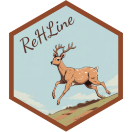
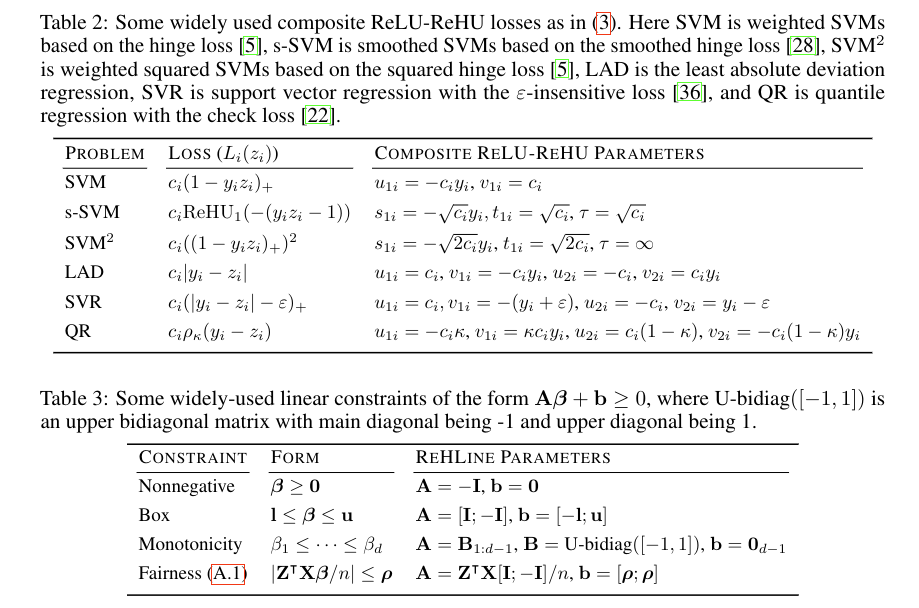

# ReHLine-Python: Efficient Solver for ERM with PLQ Loss and Linear Constraints <a href="https://github.com/softmin/ReHLine"></a>

[](https://badge.fury.io/py/rehline)
[](https://opensource.org/licenses/MIT)
[](https://rehline-python.readthedocs.io)
[](https://openreview.net/pdf?id=3pEBW2UPAD)
[](https://pepy.tech/project/rehline)
[](https://github.com/softmin/ReHLine-python/actions)

> **Fast, scalable, and scikit-learn compatible optimization for machine learning**

**ReHLine-Python** is the official Python implementation of ReHLine, a powerful solver for large-scale **empirical risk minimization (ERM) problems** with **convex piecewise linear-quadratic (PLQ) loss functions** and **linear constraints**. Built with high-performance C++ core and seamless Python integration, ReHLine delivers exceptional speed while maintaining ease of use.

See more details in the [ReHLine documentation](https://rehline-python.readthedocs.io).

## ✨ Key Features

- **🚀 Blazing Fast**: Linear computational complexity per iteration, scales to millions of samples
- **🎯 Versatile**: Supports any convex PLQ loss (hinge, check, Huber, and more)
- **🔒 Constrained Optimization**: Handle linear equality and inequality constraints
- **📊 Scikit-Learn Compatible**: Drop-in replacement with `GridSearchCV`, `Pipeline` support
- **🐍 Pythonic API**: Both low-level and high-level interfaces for flexibility


## 📦 Installation

### Quick Install

```bash
pip install rehline
```

### Development Install

For contributors and developers:

```bash
git clone https://github.com/softmin/ReHLine-python.git
cd ReHLine-python
pip install -e ".[dev]"
```

To run tests:

```bash
pytest tests/
```

## 🚀 Quick Start

### Scikit-Learn Style API (Recommended)

[](https://colab.research.google.com/drive/12D2HLkCTFUAR8ZrfNcpqVf8hwf2Vzg3V?usp=sharing)

ReHLine provides `plq_Ridge_Classifier` and `plq_Ridge_Regressor` that work seamlessly with scikit-learn:

```python
from rehline import plq_Ridge_Classifier
from sklearn.datasets import make_classification
from sklearn.model_selection import train_test_split, GridSearchCV
from sklearn.pipeline import Pipeline
from sklearn.preprocessing import StandardScaler

# Generate dataset
X, y = make_classification(n_samples=1000, n_features=20, random_state=42)
X_train, X_test, y_train, y_test = train_test_split(X, y, test_size=0.2)

# Simple usage
clf = plq_Ridge_Classifier(loss={'name': 'svm'}, C=1.0)
clf.fit(X_train, y_train)
print(f"Accuracy: {clf.score(X_test, y_test):.3f}")

# Use in Pipeline
pipeline = Pipeline([
    ('scaler', StandardScaler()),
    ('classifier', plq_Ridge_Classifier(loss={'name': 'svm'}))
])
pipeline.fit(X_train, y_train)

# Hyperparameter tuning with GridSearchCV
param_grid = {
    'C': [0.1, 1.0, 10.0],
    'loss': [{'name': 'svm'}, {'name': 'sSVM'}]
}
grid_search = GridSearchCV(plq_Ridge_Classifier(loss={"name": "svm"}), param_grid, cv=5)
grid_search.fit(X_train, y_train)
print(f"Best params: {grid_search.best_params_}")
```

> See more details in [ReHLine with Scikit-Learn](https://rehline-python.readthedocs.io/en/latest/tutorials/ReHLine_sklearn.html).

### Low-Level API for Custom Problems

```python
from rehline import ReHLine
import numpy as np

# Generate sample data
np.random.seed(42)
X = np.random.randn(100, 5)
y = np.random.choice([-1, 1], size=100)
n, d = X.shape
C = 1.0

# Define custom PLQ loss parameters
clf = ReHLine()
# Set custom U, V matrices for ReLU loss
# and S, T, tau for ReHU loss
## U
clf._U = -(C*y).reshape(1,-1)
## V
clf._V = (C*np.ones(n)).reshape(1,-1)

# Set custom linear constraints A*beta + b >= 0
X_sen = X[:,0]
tol_sen = 0.1
clf._A = np.repeat([X_sen @ X], repeats=[2], axis=0) / n
clf._A[1] = -clf._A[1]

clf.fit(X)
```

> See more detailed in [Manual ReHLine Formulation](https://rehline-python.readthedocs.io/en/latest/tutorials/ReHLine_manual.html).


## 🎯 Use Cases

ReHLine excels at solving a wide range of machine learning problems:

| **Problem** | **Description** | **Key Benefits** |
|------------|-----------------|------------------|
| **Support Vector Machines** | Binary and multi-class classification | 100-400× faster than CVXPY solvers |
| **Fair Machine Learning** | Classification with fairness constraints | Handles demographic parity efficiently |
| **Quantile Regression** | Robust conditional quantile estimation | 2800× faster than general solvers |
| **Huber Regression** | Outlier-resistant regression | Superior to specialized solvers |
| **Sparse Learning** | Feature selection with L1 regularization | Scales to high dimensions |
| **Custom Optimization** | Any PLQ loss with linear constraints | Flexible framework for research |

<!--
## 📝 Formulation

**ReHLine** is designed to address the empirical regularized ReLU-ReHU minimization problem, named *ReHLine optimization*, of the following form:

$$
\min_{\mathbf{\beta} \in \mathbb{R}^d} \sum_{i=1}^n \sum_{l=1}^L \text{ReLU}( u_{li} \mathbf{x}_ i^\intercal \mathbf{\beta} + v_{li}) + \sum_{i=1}^n \sum_{h=1}^H {\text{ReHU}}_ {\tau_{hi}}( s_{hi} \mathbf{x}_ i^\intercal \mathbf{\beta} + t_{hi}) + \frac{1}{2} \Vert \mathbf{\beta} \Vert_2^2, \qquad \text{ s.t. } \mathbf{A} \mathbf{\beta} + \mathbf{b} \geq \mathbf{0},
$$

where $\mathbf{U} = (u_{li}),\mathbf{V} = (v_{li}) \in \mathbb{R}^{L \times n}$ and $\mathbf{S} = (s_{hi}),\mathbf{T} = (t_{hi}),\mathbf{\tau} = (\tau_{hi}) \in \mathbb{R}^{H \times n}$ are the ReLU-ReHU loss parameters, and $(\mathbf{A},\mathbf{b})$ are the constraint parameters.
The ReLU and ReHU functions are defined as $\mathrm{ReLU}(z)=\max(z,0)$ and

$$
\mathrm{ReHU}_\tau(z) =
  \begin{cases}
  \ 0,                     & z \leq 0 \\
  \ z^2/2,                 & 0 < z \leq \tau \\
  \ \tau( z - \tau/2 ),   & z > \tau
  \end{cases}.
$$

This formulation has a wide range of applications spanning various fields, including statistics, machine learning, computational biology, and social studies. Some popular examples include SVMs with fairness constraints (FairSVM), elastic net regularized quantile regression (ElasticQR), and ridge regularized Huber minimization (RidgeHuber).

 -->

## ⚡ Performance Benchmarks

ReHLine delivers **exceptional speed** compared to state-of-the-art solvers. Here are speed-up factors on real-world datasets:

### Speed Comparison vs. Popular Solvers

| **Task** | **vs. ECOS** | **vs. MOSEK** | **vs. SCS** | **vs. Specialized Solvers** |
|----------|--------------|---------------|-------------|----------------------------|
| **SVM** | **415×** faster | **∞** (failed) | **340×** faster | **4.5×** vs. LIBLINEAR |
| **Fair SVM** | **273×** faster | **100×** faster | **252×** faster | **∞** vs. DCCP (failed) |
| **Quantile Regression** | **2843×** faster | **∞** (failed) | **∞** (failed) | — |
| **Huber Regression** | **∞** (failed) | **452×** faster | **∞** (failed) | **2.4×** vs. hqreg |
| **Smoothed SVM** | — | — | — | **1.6-2.3×** vs. SAGA/SAG/SDCA/SVRG |

> **Note**: "∞" indicates the competing solver failed to produce a valid solution or exceeded time limits. Results from [NeurIPS 2023 paper](https://openreview.net/pdf?id=3pEBW2UPAD).

### Reproducible Benchmarks (powered by benchopt)

All benchmarks are reproducible via [benchopt](https://github.com/benchopt/benchopt) at our [ReHLine-benchmark](https://github.com/softmin/ReHLine-benchmark) repository.

| **Problem** | **Benchmark Code** | **Interactive Results** |
|------------|-------------------|------------------------|
| SVM | [Code](https://github.com/softmin/ReHLine-benchmark/tree/main/benchmark_SVM) | [📊 View](https://rehline-python.readthedocs.io/en/latest/_static/benchmark/benchmark_SVM.html) |
| Smoothed SVM | [Code](https://github.com/softmin/ReHLine-benchmark/tree/main/benchmark_sSVM) | [📊 View](https://rehline-python.readthedocs.io/en/latest/_static/benchmark/benchmark_sSVM.html) |
| Fair SVM | [Code](https://github.com/softmin/ReHLine-benchmark/tree/main/benchmark_FairSVM) | [📊 View](https://rehline-python.readthedocs.io/en/latest/_static/benchmark/benchmark_FairSVM.html) |
| Quantile Regression | [Code](https://github.com/softmin/ReHLine-benchmark/tree/main/benchmark_QR) | [📊 View](https://rehline-python.readthedocs.io/en/latest/_static/benchmark/benchmark_QR.html) |
| Huber Regression | [Code](https://github.com/softmin/ReHLine-benchmark/tree/main/benchmark_Huber) | [📊 View](https://rehline-python.readthedocs.io/en/latest/_static/benchmark/benchmark_Huber.html) |

## 🤝 Contributing

We welcome contributions! Whether it's bug reports, feature requests, or code contributions:

- 🐛 [Open an issue](https://github.com/softmin/ReHLine-python/issues)
- 💬 [Start a discussion](https://github.com/softmin/ReHLine-python/discussions)
- 🔀 Submit a pull request

## 📚 Citation

If you use ReHLine in your research, please cite our NeurIPS 2023 paper:

```bibtex
@inproceedings{dai2023rehline,
  title={ReHLine: Regularized Composite ReLU-ReHU Loss Minimization with Linear Computation and Linear Convergence},
  author={Dai, Ben and Qiu, Yixuan},
  booktitle={Thirty-seventh Conference on Neural Information Processing Systems},
  year={2023}
}
```

## 🔗 ReHLine Ecosystem

<table>
<tr>
<td width="50%">

### 🏠 Core Projects
- **[ReHLine](https://github.com/softmin/ReHLine)** - Main repository and documentation
- **[ReHLine-python](https://github.com/softmin/ReHLine-python)** - Python interface (this repo)
- **[ReHLine-r](https://github.com/softmin/ReHLine-r)** - R interface
- **[ReHLine-cpp](https://github.com/softmin/ReHLine-cpp)** - High-performance C++ core

</td>
<td width="50%">

### 📊 Resources
- **[ReHLine-benchmark](https://github.com/softmin/ReHLine-benchmark)** - Reproducible benchmarks
- **[Project Homepage](https://rehline.github.io)** - Official website
- **[Documentation](https://rehline-python.readthedocs.io)** - Full Python docs
- **[NeurIPS 2023 Paper](https://openreview.net/pdf?id=3pEBW2UPAD)** - Research paper

</td>
</tr>
</table>
