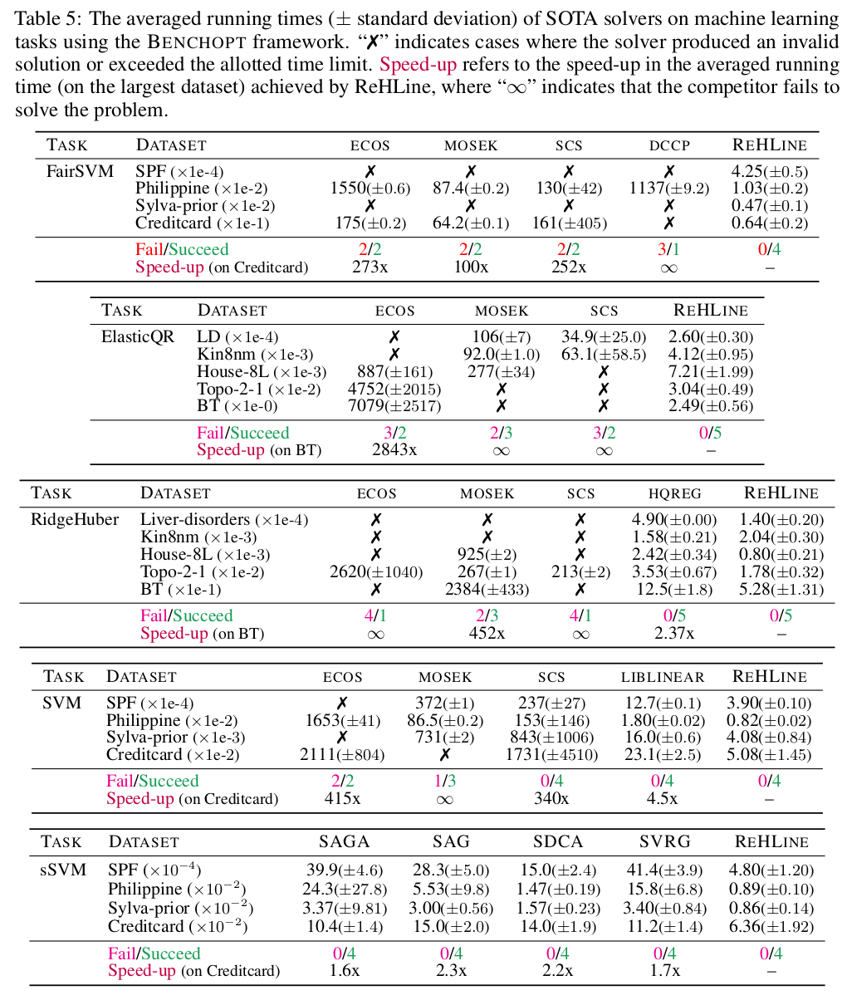

Benchmark
=========

We have developed a benchmark for evaluating the performance of optimization methods, which is built on top of the `benchopt <https://github.com/benchopt/benchopt>`_. For those interested in reproducing the benchmark results presented in our paper, we provide a dedicated repository, `ReHLine-benchmark <https://github.com/softmin/ReHLine-benchmark>`_, which contains all the necessary resources and instructions.

.. table:: **Benchmark Results**
   :align: left

   +-------------+--------------------------------------------------------+
   | Problem     | Results                                                |
   +=============+========================================================+
   | FairSVM_    | `Result <./_static/benchmark/benchmark_FairSVM.html>`__|
   +-------------+--------------------------------------------------------+
   | ElasticQR_  | `Result <./_static/benchmark/benchmark_QR.html>`__     |
   +-------------+--------------------------------------------------------+
   | RidgeHuber_ | `Result <./_static/benchmark/benchmark_Huber.html>`__  |
   +-------------+--------------------------------------------------------+
   | SVM_        | `Result <./_static/benchmark/benchmark_SVM.html>`__    |
   +-------------+--------------------------------------------------------+
   | sSVM_       | `Result <./_static/benchmark/benchmark_sSVM.html>`__   |
   +-------------+--------------------------------------------------------+

.. _FairSVM: https://github.com/softmin/ReHLine-benchmark/tree/main/benchmark_FairSVM
.. _ElasticQR: https://github.com/softmin/ReHLine-benchmark/tree/main/benchmark_QR
.. _RidgeHuber: https://github.com/softmin/ReHLine-benchmark/tree/main/benchmark_Huber
.. _SVM: https://github.com/softmin/ReHLine-benchmark/tree/main/benchmark_SVM
.. _sSVM: https://github.com/softmin/ReHLine-benchmark/tree/main/benchmark_sSVM

.. admonition:: Note
   :class: tip

   You may select the `log-log scale` option in the left sidebar, as this will significantly improve the readability of the results.

Results Overview
----------------

