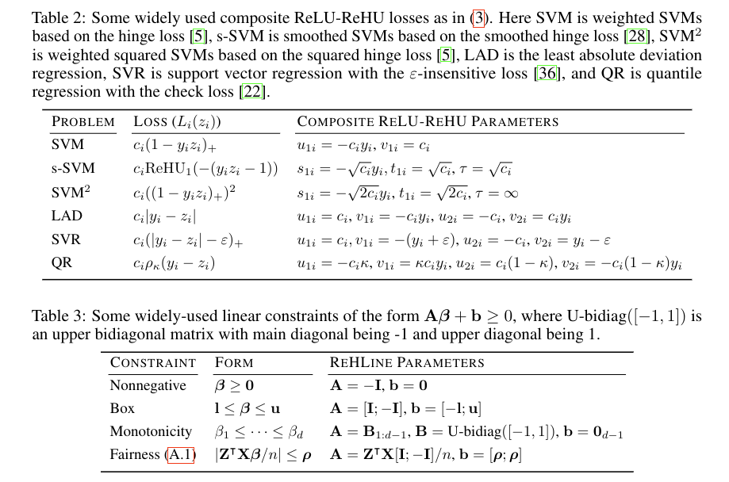

ReHLine with Scikit-Learn
~~~~~~~~~~~~~~~~~~~~~~~~~~~

.. image:: https://scikit-learn.org/stable/_static/scikit-learn-logo-small.png
   :alt: scikit-learn
   :align: right
   :width: 150px

`ReHLine` provides a versatile and powerful solver for empirical risk minimization problems with linear constraints. To make it even more accessible and easy to integrate into standard machine learning workflows, it now comes with a scikit-learn compatible estimator.

This means you can use `ReHLine` just like any other scikit-learn estimator, allowing you to seamlessly use it with scikit-learn's rich ecosystem, including tools like `Pipeline` for building workflows and `GridSearchCV` for hyperparameter tuning.

This tutorial will guide you through the process of using the `ReHLine` scikit-learn estimator, from basic usage to advanced integration with scikit-learn's powerful features.

Mathematical Formulation
------------------------

The `ReHLine` solver addresses the following empirical risk minimization problem with a piecewise linear-quadratic (PLQ) loss, ridge regularization, and linear constraints. The objective function is:

.. math::

    \min_{\pmb{\beta} \in \mathbb{R}^d} \sum_{i=1}^n \text{PLQ}(y_i, \mathbf{x}_i^T \pmb{\beta}) + \frac{1}{2} \| \pmb{\beta} \|_2^2, \ \text{ s.t. } \
    \mathbf{A} \pmb{\beta} + \mathbf{b} \geq \mathbf{0},

where:
    - :math:`\text{PLQ}(\cdot, \cdot)` is a convex piecewise linear-quadratic loss function. You can find built-in loss functions in the `Loss <./loss.rst>`_ section.
    - :math:`\mathbf{A}` is a :math:`K \times d` matrix and :math:`\mathbf{b}` is a :math:`K`-dimensional vector representing `K` linear constraints. See `Constraints <./constraint.rst>`_ for more details.

For example, `ReHLine` supports the following loss functions and constraints:

Basic Usage
-----------

Here is a simple example of how to use the `plq_Ridge_Classifier` for a binary classification task. The estimator follows the standard scikit-learn API: `fit(X, y)` and `predict(X)`.

.. code-block:: python

   import numpy as np
   from sklearn.datasets import make_classification
   from sklearn.model_selection import train_test_split
   from rehline import plq_Ridge_Classifier

   # Generate synthetic data
   X, y = make_classification(n_samples=100, n_features=10, random_state=42)

   # Split data into training and testing sets
   X_train, X_test, y_train, y_test = train_test_split(X, y, test_size=0.2, random_state=42)

   # Initialize and train the classifier
   # We use the SVM loss as an example
   clf = plq_Ridge_Classifier(loss={'name': 'svm'}, C=1.0)
   clf.fit(X_train, y_train)

   # Make predictions
   y_pred = clf.predict(X_test)

   # Print the accuracy
   accuracy = clf.score(X_test, y_test)
   print(f"Accuracy: {accuracy:.2f}")

Using ReHLine with Pipelines
----------------------------

You can easily integrate `ReHLine` estimators into scikit-learn `Pipeline` objects. This is useful for chaining preprocessing steps, such as feature scaling, with the `ReHLine` estimator.

.. code-block:: python

   from sklearn.pipeline import Pipeline
   from sklearn.preprocessing import StandardScaler

   # Create a pipeline with a scaler and the classifier
   pipe = Pipeline([
       ('scaler', StandardScaler()),
       ('clf', plq_Ridge_Classifier(loss={'name': 'svm'}))
   ])

   # The pipeline can be used as a single estimator
   pipe.fit(X_train, y_train)
   accuracy = pipe.score(X_test, y_test)
   print(f"Pipeline Accuracy: {accuracy:.2f}")

Hyperparameter Tuning with GridSearchCV
---------------------------------------

The scikit-learn compatibility also allows you to use `GridSearchCV` to find the best hyperparameters for your `ReHLine` model.

.. code-block:: python

   from sklearn.model_selection import GridSearchCV

   # Define the parameter grid to search
   param_grid = {
       'clf__C': [0.1, 1.0, 10.0],
       'clf__loss': [{'name': 'svm'}, {'name': 'sSVM'}]
   }

   # Create the GridSearchCV object
   grid_search = GridSearchCV(pipe, param_grid, cv=5)
   grid_search.fit(X_train, y_train)

   # Print the best parameters and score
   print(f"Best Parameters: {grid_search.best_params_}")
   print(f"Best CV Score: {grid_search.best_score_:.2f}")

Example
-------

.. nblinkgallery::
   :caption: Empirical Risk Minimization
   :name: rst-link-gallery

   ../examples/Sklearn_Mixin.ipynb
   ../examples/ElasticNet.ipynb

Release compatibility and numerical diagnostics
-----------------------------------------------

The sklearn estimators require scikit-learn 1.6 or newer. Constructors store
parameters unchanged, and validation occurs in ``fit``, including after
``set_params`` or a grid-search parameter update. ``loss=None`` selects median
regression and ``multi_class=None`` selects one-vs-rest classification at fit
time. Negative or entirely zero sample weights are rejected. Individual zero
weights exclude those observations from fitting. For classifiers, this also
applies to zero weights supplied through ``class_weight``; at least two classes
must retain positive effective weight.

For ``class_weight="balanced"``, let :math:`w_i` be the supplied sample weight
(or 1 when omitted), :math:`W=\sum_i w_i`, and
:math:`W_c=\sum_{i:y_i=c}w_i`. The effective loss weight is
:math:`w_i W/(K W_{y_i})`, where :math:`K` counts the classes remaining after
zero-weight rows are removed. Every class therefore has total loss weight
:math:`W/K`. Balancing is computed once on the original labels, before OvR or
OvO decomposition; an OvO pair retains those global weights.

This matches ``LinearSVC``'s weighted balancing from scikit-learn 1.7 onward.
ReHLine uses this definition on all supported versions, including 1.6, whose
own ``LinearSVC`` balancing did not incorporate sample weights. Integer sample
weights give the same objective as repeating observations when the constraints
are fixed. This equivalence does not extend to data-derived fairness constraints:
their statistics use equally weighted retained rows. A ``class_weight`` dictionary
continues to multiply sample weights by the corresponding original-label value.

If ``fit`` raises an exception, the previous successful fitted state
(including feature names, classes, coefficients and diagnostics) remains usable.
This also applies to errors in multiclass workers and convergence warnings
treated as exceptions. A failed first fit leaves the estimator unfitted.
Parameters changed with ``set_params`` are not rolled back; correct those
parameters before retrying the fit.
Finite inputs can still overflow during arithmetic. When solver computations
or final objectives are nonfinite, fitting raises ``OverflowError`` rather
than returning a successful convergence certificate. This error also preserves
the previous fitted state. The solver does not automatically rescale the
features or change the objective.
The same guarantee applies to raw ``ReHLine``, the two ``plqERM`` estimators,
``CQR_Ridge`` and ``plqMF_Ridge``. For MF, prediction and ``obj`` use the
configuration saved by the successful fit, including bias mode, user/item
bounds, loss and penalty parameters. New parameters take effect after a
successful refit. The guarantee concerns exceptions: a convergence warning
that is not treated as an error still publishes the new, unconverged model.

The named-loss estimators (all four sklearn wrappers, ``plqERM_Ridge`` and
``plqERM_ElasticNet``) generate their loss matrices from ``loss``. Their legacy
``U/V/S/T/Tau`` constructor parameters must be ``None`` or empty. Nonempty
values now raise ``ValueError`` during fitting instead of being silently ignored.
Use ``ReHLine`` or ``ReHLine_solver`` for manually specified loss matrices.

With ``fit_intercept=True``, a constant column with value
``intercept_scaling`` is added internally. The returned ``intercept_`` is the
actual intercept used by ``predict``. The regularized synthetic coefficient is
``intercept_ / intercept_scaling``, so intercept regularization is retained.
Built-in constraints apply only to feature coefficients. A custom constraint
matrix may have ``n_features`` columns, or ``n_features + 1`` columns when its
last column explicitly constrains the actual intercept.

Constructor ``A`` and ``b`` specify additional linear constraints. Supplying both
``A/b`` and ``constraint`` combines the two constraint lists: **every constraint
must hold**. A ``UserWarning`` announces this combination once per ``fit``, also
for multiclass models. Neither input overrides the other. ``A`` and ``b`` must
be supplied together; they follow the same feature/intercept-column convention
as custom constraints. The low-level ``plqERM_Ridge`` and ``plqERM_ElasticNet``
also combine these inputs, with columns corresponding directly to their input X.

Built-in ``fair`` constraints center the sensitive columns internally when
computing covariance, without modifying the features used to train the model.
Statistics use equally weighted retained training rows; OvO recomputes them
within each class pair. Positive sample/class weights affect the loss, while
zero effective weights remove rows before these statistics are constructed.
See :doc:`constraint` for the formula, reference populations, units and limits.

Multiclass scores and warm starts
^^^^^^^^^^^^^^^^^^^^^^^^^^^^^^^^^^^^^

``multi_class`` selects the **training strategy**, while
``decision_function_shape`` selects the **score output format**. In particular,
``decision_function_shape='ovr'`` does not imply OvR training. Both classifier
types use the following rules for :math:`K>2` retained classes:

.. list-table:: Training and output format
   :header-rows: 1

   * - ``multi_class``
     - ``decision_function_shape``
     - ``decision_function(X)``
   * - ``'ovr'`` or ``None``
     - ``'ovr'`` (default)
     - K class-score columns
   * - ``'ovo'``
     - ``'ovr'`` (default)
     - K aggregated class-score columns
   * - ``'ovo'``
     - ``'ovo'``
     - K(K-1)/2 class-pair margin columns
   * - ``'ovr'`` or ``None``
     - ``'ovo'``
     - ValueError: no class-pair models were trained

The default output follows ``classes_`` order. With OvO training, it combines
pair votes and bounded confidence scores. Use this default for class-based
sklearn consumers such as ``CalibratedClassifierCV`` and
``top_k_accuracy_score``. Raw pair scores are not class scores, even for three
classes where both formats happen to have three columns. Neither format gives
probabilities.

For raw OvO output, columns follow sorted ``classes_`` pairs in this order:
``(0,1), (0,2), ..., (0,K-1), (1,2), ..., (K-2,K-1)``. Like
`SVC <https://scikit-learn.org/stable/modules/generated/sklearn.svm.SVC.html>`_,
a positive multiclass pair score favors the **first** class; a negative score
favors the second. The stored ``coef_``, ``intercept_`` and entries of
``estimators_`` retain their existing training orientation, positive for the
second class. Consequently raw multiclass output is
``-(X @ coef_.T + intercept_)``. Only the returned score is negated: asymmetric
coefficient constraints, dual states and objective values keep their original
meaning. Users of the former second-class-positive raw output must account for
this sign change when migrating.

Binary classification always returns shape ``(n_samples,)``, positive for
``classes_[1]``, for either valid output format and either training strategy.
An invalid format raises ValueError, including for binary problems. The
multiclass combination check uses the classes retained after zero effective
weights are removed. Changing the format after fitting validates against the
fitted strategy, without retraining:

.. code-block:: python

   from rehline import plq_Ridge_Classifier

   clf = plq_Ridge_Classifier(loss={'name': 'svm'}, multi_class='ovo')
   clf.fit(X, y)
   class_scores = clf.decision_function(X)  # default: one column per class
   clf.set_params(decision_function_shape='ovo')
   pair_scores = clf.decision_function(X)   # one column per class pair
   clf.set_params(decision_function_shape='ovr')

There is no separate ``pairwise_decision_function`` method. The proposed method
was replaced before release by the sklearn-style parameter above.

``predict`` is independent of the output format and preserves the existing
vote/confidence rule. Among classes tied for the most pair votes, summed
confidence breaks the tie; a remaining exact class-score tie selects the first
class in ``classes_``. A zero pair margin votes for the first class of that
pair. This follows the aggregation used by
`OneVsOneClassifier <https://scikit-learn.org/stable/modules/generated/sklearn.multiclass.OneVsOneClassifier.html>`_.
It differs from SVC's default ``break_ties=False``, which selects the first class
among tied vote counts without confidence correction. ReHLine has no
``break_ties`` parameter. Binary prediction selects ``classes_[1]`` only for
a strictly positive margin; zero selects ``classes_[0]``, consistently with
sklearn linear classifiers. This changes the earlier binary zero-margin rule.
There is no epsilon band around zero. Native OvO and
``OneVsOneClassifier`` wrapping a ReHLine binary classifier therefore use the
same zero-margin vote.

Switching the output format changes neither predictions nor the fitted
coefficients, constraints, optimization objective or warm-start state.
``decision_function_shape`` is supported by ``get_params``, ``set_params``,
``clone``, pipelines and parameter grids.

Compact inference snapshots
^^^^^^^^^^^^^^^^^^^^^^^^^^^

Call ``snapshot = fitted_model.to_inference()`` on any of the four sklearn
estimators to copy the prediction state without the training loss matrices,
dual variables or inner ERM models. The original model is unchanged and can
continue fitting with its existing warm-start state.

Snapshots preserve ``predict``, classifier ``decision_function``, feature names,
class labels, coefficient/intercept arrays and the final ``objective_``,
``dual_objective_``, ``dual_gap_``, ``kkt_residual_``, ``constraint_violation_``,
``scaled_constraint_violation_``,
``converged_`` and ``n_iter_`` values. These diagnostics describe the successful
training fit, not new evaluation data. Classifier snapshots also support
``set_params(decision_function_shape='ovr'|'ovo')`` with the same restrictions
and pair-score conventions. They serialize with pickle/joblib and can replace
the final step of an already fitted pipeline for prediction.

Snapshots cannot fit or warm-start; ``fit`` raises ``TypeError``. Use the
original estimator for refitting, calibration that trains a base estimator,
or grid search. Training loss evaluation and optimization traces are not
included. Arrays are independent copies, so editing/refitting the original
model does not change an exported snapshot. This export does not include a
pipeline's preprocessing steps; retain those steps when predicting raw data.

.. code-block:: python

   model.fit(X_train, y_train)
   snapshot = model.to_inference()
   prediction = snapshot.predict(X_test)

Warm starts
^^^^^^^^^^^

``warm_start=True`` reuses compatible dual states for each class or class pair.
Changing the multiclass strategy or class set discards the previous task states;
each binary model also checks loss and dimension compatibility. Every refit
still runs the solver's convergence checks. Near an exact decision tie,
floating-point differences between equivalent cold and warm solutions can
change the selected label; convergence and objective agreement do not imply a
strictly separated classification decision.

OvO subsets are created inside executing worker tasks, with bounded dispatch,
so training no longer retains a dense feature copy for every class pair at once.
Fitted dual states still occupy memory proportional to the binary problems.
For prediction and the default class-score output, pair margins are aggregated
in blocks of at most 64 pairs. Intermediate inference memory is therefore
proportional to the number of samples times ``K + 64``, rather than the number
of samples times all class pairs. Explicit ``decision_function_shape='ovo'``
still returns the full ``K * (K - 1) / 2`` columns. Pair ordering, score signs
and vote/confidence tie rules are unchanged; numerical scores can differ in the
last floating-point bits when matrix multiplication uses different block sizes.

Optimization diagnostics
^^^^^^^^^^^^^^^^^^^^^^^^

Every fitted estimator exposes the following final diagnostics, even when
``verbose=0``:

* ``objective_``: loss and penalties in the native solver's normalized objective.
* ``dual_objective_``: the maximized dual lower bound.
* ``dual_gap_``: the non-negative objective-minus-dual difference when feasible
  within the scaled constraint tolerance; infinity otherwise.
* ``constraint_violation_``: the largest violation of ``A beta + b >= 0`` in
  the original input units. Multiplying a constraint row changes these units.
* ``scaled_constraint_violation_``: the largest violation after dividing each
  nonzero constraint row and its offset by that row's largest absolute coefficient.
* ``kkt_residual_``: the maximum absolute projected dual gradient, using the
  scaled constraint rows and the original loss/penalty coordinates.
* ``converged_``: whether the KKT residual and scaled constraint violation meet
  ``tol``, and ``abs(objective_ - dual_objective_) / max(1, abs(objective_),
  abs(dual_objective_)) <= tol``. The absolute difference also checks negative
  numerical gaps instead of treating them automatically as zero.
* ``n_iter_``: the number of completed coordinate-descent sweeps.

These attributes are arrays, one per binary subproblem, for multiclass models.
For ElasticNet the native objective is the documented objective divided by
``1 - l1_ratio``. Historical ``dual_obj_`` traces retain their negative-dual
convention. A gap computed within feasibility tolerance is an approximate
diagnostic; use the feasibility and KKT residuals as well. The stricter
convergence check can require a larger ``max_iter`` on difficult problems.

Constraint scaling changes neither the feasible set nor the loss or penalties;
features are not rescaled. Original-unit ``constraint_violation_`` can exceed
``tol`` for large rows even when the scaled violation passes. Public constraint
multipliers (``xi`` / ``_xi``) remain in the original row units. Estimator warm
refits convert cached multipliers when row scales change; direct solver callers
must express supplied ``xi`` in the units of their current ``A/b``. For a row
multiplied by positive ``s``, the equivalent multiplier is divided by ``s``.
Zero rows are checked exactly, without squaring small coefficients. If normalized
offsets or returned original-unit multipliers cannot be represented in float64,
the solver raises ``OverflowError``. A failed refit preserves the fitted model.

The sklearn regressors expose predictions through ``predict``. Replace calls
to their former ``decision_function`` alias with ``predict``. Classifiers and
low-level ERM estimators retain ``decision_function``. All applicable sklearn
checks run without expected-failure exceptions.
